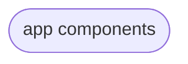
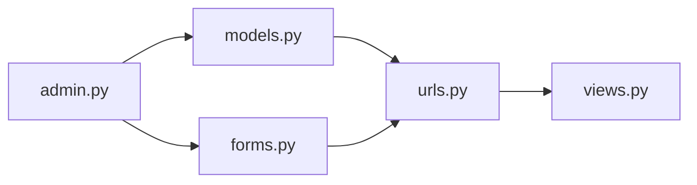

# IP Address api search

This project is built for users to search Apis of different countries,and  required api payload returned ,the information saved in the backend.
The information will be used to create **charts,table and heatmap** to show which country or countries the user searches most.
## API Reference

#### Get required items/Payload

```http
  GET http://ipwho.is/[IP address]
```

```

| Parameter   | Type  | Description                       
| :-----------| :-----| :-------------------------------- 
| `ip`        |string |Ip address     
| continent   |string |The name of continent                            
| country     |string |The name of country                
| country_code|integer|The two-letter(3166-1)                              
| region      |string |The name of region               
| region_code |integer|The state/regions code(3166-2)                              
|  city       |string |The name of city
|  latitude   |float  |The approximate (WGS84) latitude
|  longitude  |float  |The approximate (WGS84) longitude


## Run Locally

#create a folder [within the folder run the following commands]

Create virtual environment

```bash
pip install virtualenvwrapper
```
 $ mkvirtualenv <venv_name>


Clone the project

``` bash
   
$ git clone https://ezemiller@bitbucket.org/ezemiller/duxproject.git

```

```bash
 $ pip install -r requirements.txt 
```
**Go to the project directory**

```bash
 $  cd duxproject
```
 **Go to where the level of django project and manage.py are at thesame leve and run;**
```bash
 $ python manage.py makemigrations
```
```bash
 $ python manage.py migrate
```
```bash
 $python manage.py runserver 
 ```
  ** You will be directed to click http://127.0.0.1:8000/  ** 
 
 $ python manage.py createsuperuser[This gives you admin rights]

#core logic
This application is developed and designed  with django, and django design is based on the principle of app warehousing , where each component of a project can become a separate app.






 
[click: django app setup](https://docs.djangoproject.com/en/4.0/intro/tutorial01/)
